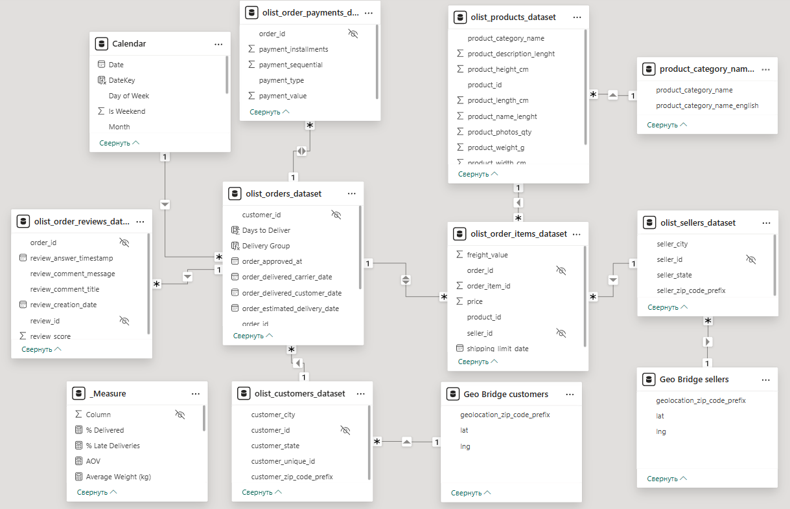
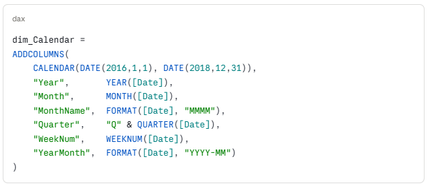
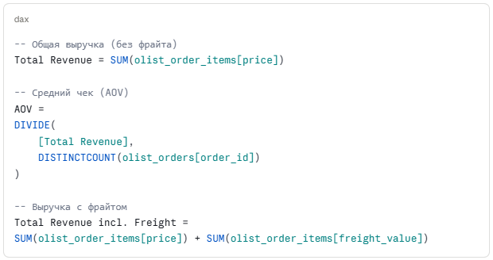
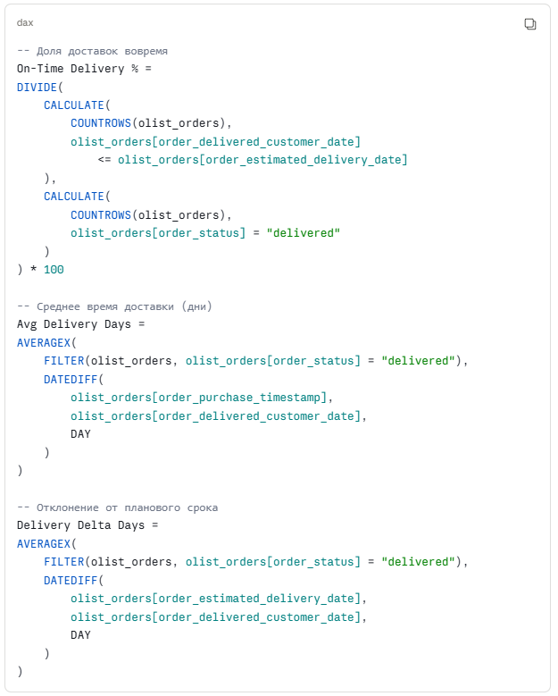
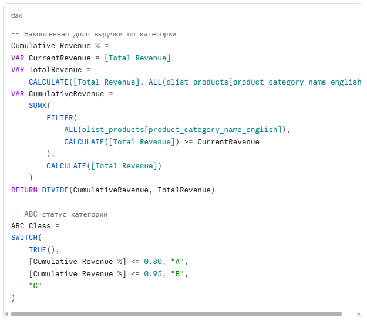
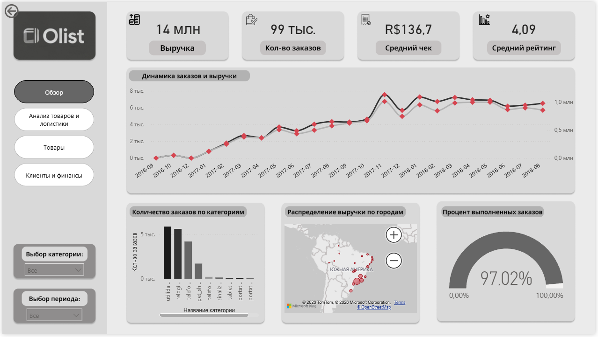
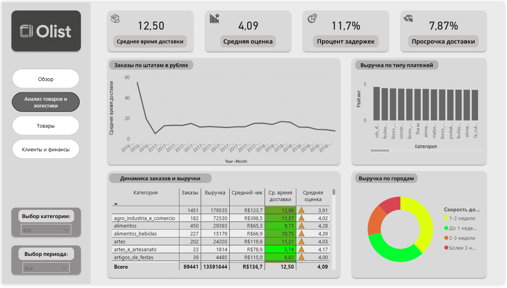
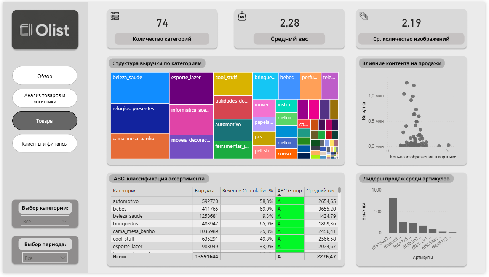
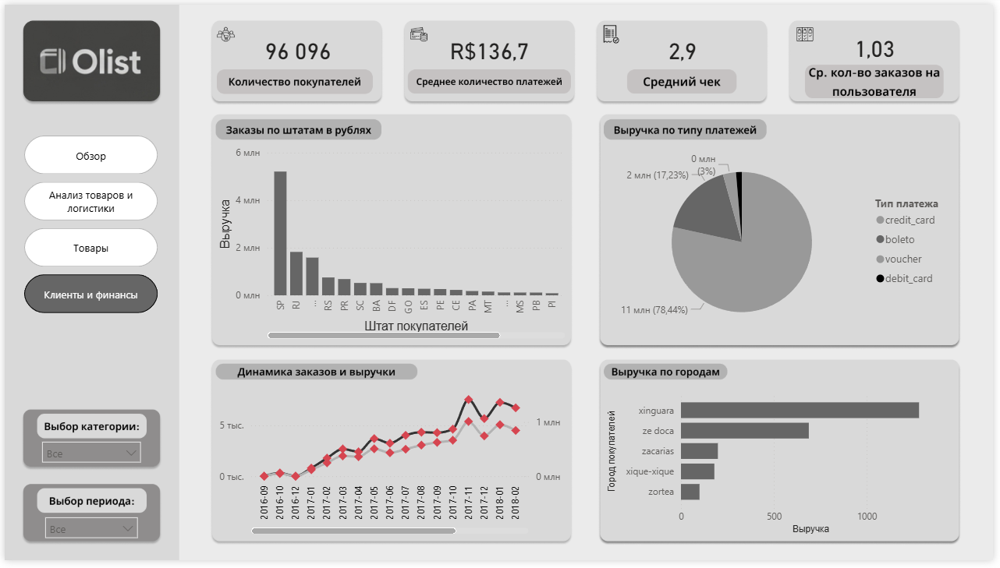
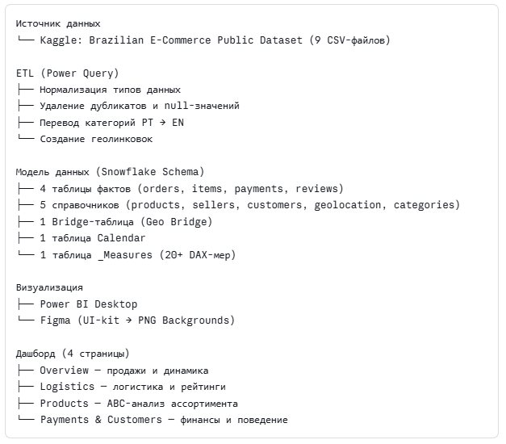

# **Аналитическая экосистема бразильского e-commerce: Olist**

## **О проекте**

**Индустрия:** E-commerce / Маркетплейсы  
**Платформа:** Olist (Бразилия)  
**Инструменты:** Power BI Desktop, DAX, Power Query, Figma  
**Датасет:** [Brazilian E-Commerce Public Dataset by Olist — Kaggle](https://www.kaggle.com/datasets/olistbr/brazilian-ecommerce)**Масштаб:** 100 000+ заказов, 9 реляционных таблиц, 70+ товарных категорий  
**Результат:** Четырёхстраничный интерактивный дашборд — от обзора KPI до товарного ABC-анализа

## **Контекст и постановка задачи**

Olist — крупнейший бразильский маркетплейс, агрегирующий тысячи продавцов и сотни тысяч заказов по всей стране. В сыром виде данные представляли собой классический «чёрный ящик»: компания видела общую выручку, но не могла быстро ответить на операционные вопросы — где именно в логистической цепочке теряется время, какие категории товаров реально тянут маржу вверх, а какие занимают складские мощности впустую.

### **Выявленные проблемы (Pain Points)**

|     |     |
| --- | --- |
| **Проблема** | **Последствия для бизнеса** |
| **Разрозненность данных** — 9 несвязанных таблиц | Анализ занимал часы ручной сборки в Excel |
| **Географическая неопределённость** — два типа локаций (клиент vs. продавец) | Конфликты в связях → неверный расчёт выручки по регионам |
| **Отсутствие логистического контроля** | Неизвестно, на каком этапе происходит сбой: склад или доставка |
| **Перегруженный ассортимент** — 70+ категорий | Невозможно выделить фокусные группы для маркетинга |

### **Три уровня задач**

Архитектурная — спроектировать модель данных, исключающую дублирование и ошибки в расчётах при объединении 9 таблиц.

Аналитическая — разработать систему из 20+ DAX-мер для оценки операционной эффективности: AOV, доля просроченных доставок, динамический ABC-статус.

Визуальная — создать интерфейс с навигацией от макро-аналитики (весь рынок) до микро-аналитики (конкретный товар) в два клика.

## **Архитектура и моделирование данных**

### **Схема «Снежинка» (Snowflake Schema)**

В отличие от классической «Звезды», схема «Снежинка» позволяет нормализовать справочники — это критично при работе с географическими иерархиями (штат → город → почтовый код), где денормализация привела бы к колоссальному дублированию строк.

**Состав модели:**

|     |     |     |
| --- | --- | --- |
| **Таблица** | **Тип** | **Содержание** |
| olist_orders | Факт | Заказы: статус, даты, customer_id |
| olist_order_items | Факт | Позиции заказа: товар, продавец, цена, фрайт |
| olist_order_payments | Факт | Способы оплаты, суммы, рассрочка |
| olist_order_reviews | Факт | Оценки покупателей (1–5), тексты отзывов |
| olist_products | Dimension | Артикулы, категории, габариты |
| olist_sellers | Dimension | Продавцы, их геолокация |
| olist_customers | Dimension | Покупатели, их геолокация |
| olist_geolocation | Dimension | ZIP → штат → координаты |
| product_category_name_translation | Dimension | Перевод категорий PT → EN |
| dim_Calendar | Dimension | Кастомная таблица дат |
| bridge_Geo | Bridge | Связь клиентской и продавческой географии |

### **Ключевое техническое решение — Geo Bridge Table**

Основная архитектурная сложность: в датасете существуют два независимых географических контекста — местонахождение покупателя и местонахождение продавца. При прямой связи через geolocation возникает конфликт неоднозначности путей (Path Ambiguity), и Power BI начинает неверно агрегировать выручку по регионам — ошибка могла достигать десятков процентов.

**Решение:** Создана Bridge-таблица bridge_Geo, которая явно разделяет два географических потока:

olist_customers → bridge_Geo (customer_geo) → olist_geolocation

olist_sellers → bridge_Geo (seller_geo) → olist_geolocation

Теперь фильтр «Штат Сан-Паулу» корректно применяется либо к покупателям, либо к продавцам — в зависимости от контекста визуализации.

### **Time Intelligence — таблица календаря**

## **Аналитика и DAX-вычисления**

Разработана система из **более чем 20 мер**, сгруппированных в изолированную таблицу \_Measures. Ниже ключевые из них.

### **Финансовые KPI**

### **Логистические метрики**

### **Динамический ABC-анализ**

Главная «изюминка» аналитического блока — ABC-классификация, которая **пересчитывается в реальном времени** при применении любого фильтра (период, регион, категория):

Класс **A** — 20% категорий, генерирующих 80% выручки. Класс **B** — следующие 15%. Класс **C** — оставшийся «хвост».

## **Дашборд 1 — Анализ продаж и динамики (Overview)**

Центральная страница для мониторинга макропоказателей. Отвечает на вопрос: «Как бизнес себя чувствует прямо сейчас?»

**KPI-блок:**

- Общая выручка
- Общее число заказов
- Уникальные покупатели
- Средний чек

**Ключевые визуализации:**

- Линейный график — динамика заказов по месяцам с выявленной сезонностью (пик — ноябрь, «чёрная пятница»)
- Карта штатов Бразилии — распределение продаж по регионам. Лидер — SP (Сан-Паулу), что отражает высокую концентрацию рынка в экономическом центре страны
- Bar chart «Топ штатов» — выручка и количество заказов в разрезе регионов

**Ключевой инсайт:** Анализ временных рядов выявил выраженную сезонность и стабильный тренд роста объёма заказов. Концентрация продаж в штате SP подтверждает необходимость фокуса маркетинговых активностей на мегаполисы — они обеспечивают непропорционально большую долю выручки.

## **Дашборд 2 — Операционная эффективность и логистика**

Модуль контроля качества исполнения заказов. Отвечает на вопрос: «Где в цепочке доставки теряется качество?»

**KPI-блок:**

- Процент задержек
- Среднее время доставки
- Средняя оценка (итог: **4.09**)
- Процент просроченных доставок

**Ключевые визуализации:**

- Scatter-plot «Время доставки vs. Оценка» — прямая корреляция между задержкой и снижением рейтинга
- Карта с задержками по штатам — визуально выделяет проблемные регионы (Norte и Nordeste)
- Funnel этапов обработки заказа — breakdown по времени: одобрение → сборка → передача курьеру → доставка

**Ключевой инсайт:** Выявлена прямая корреляция между временем доставки и оценкой удовлетворённости. Задержки логистики — основной драйвер снижения рейтинга до 4.09 (при максимуме 5.0). Наибольшие задержки фиксируются в отдалённых штатах (Северный и Северо-Восточный регионы) из-за слабого покрытия курьерских сетей. Именно здесь сосредоточен потенциал для оптимизации партнёрской сети.

## **Дашборд 3 — Товарная матрица и ABC-классификация**

Инструмент категорийного менеджмента. Отвечает на вопрос: «На какие товары делать ставку, а от каких отказываться?»

**Ключевые визуализации:**

- Tree Map — категории, масштабированные по выручке, с цветовой маркировкой A/B/C
- Таблица ABC-рейтинга — категории отсортированы по накопленной доле выручки с динамически присваиваемым классом
- Bar chart «Топ-10 категорий» — выручка, количество заказов, средний чек

**ABC-результаты:**

|     |     |     |     |
| --- | --- | --- | --- |
| **Класс** | **Доля категорий** | **Доля выручки** | **Примеры категорий** |
| **A** | ~20% | 80% | beleza_saude, relojes_presentes, cama_mesa_banho |
| **B** | ~30% | 15% | informatica_acessorios, automotivo |
| **C** | ~50% | 5%  | pc_gamer, fashion_roupa_infanto_juvenil |

**Ключевой инсайт:** Категории beleza_saude (здоровье и красота) и relojes_presentes (часы и подарки) — ключевые драйверы выручки класса A. Это прямое указание для категорийного менеджера: приоритизировать закупки, расширять ассортимент и выделять складские мощности именно под эти группы. Категории класса C — кандидаты на сокращение или полный вывод из матрицы.

**Дашборд 4 — Финансовый аудит и поведение клиентов**

Анализ платёжного поведения и клиентской географии. Отвечает на вопрос: «Кто наш клиент и как он платит?»

**Ключевые визуализации:**

- Pie/Donut chart «Способы оплаты» — распределение между credit_card, boleto, voucher, debit_card
- Histogram «Рассрочка» — распределение заказов по количеству платежей (installments)
- Map «Плотность покупателей» — географическая концентрация клиентской базы
- Scatter «Регион vs. AOV» — средний чек в разрезе штатов

**Ключевой инсайт:** Подавляющее большинство транзакций — кредитные карты (~74%), причём значительная доля — с рассрочкой в 2–6 платежей. Это сигнал о высокой чувствительности бразильского покупателя к условиям оплаты: возможность рассрочки на маркетплейсе является не опцией, а конкурентным необходимостью. Разрыв в среднем чеке между мегаполисами и периферией открывает возможность для дифференцированных условий доставки (бесплатная доставка от суммы X — разной для разных регионов).

## **Дизайн и UX (Figma → Pixel Perfect)**

**\[Скриншот UI-кита в Figma: сетка дашборда, карточки KPI, цветовая палитра Corporate Modern\]**

### **Принцип Pixel Perfect**

Все четыре страницы дашборда спроектированы в Figma до начала работы в Power BI. Это позволило:

**1\.** Зафиксировать сетку и пропорции — каждый элемент на странице имеет точные размеры и отступы, исключая «дёрганье» при изменении размера окна.

2\. Согласовать дизайн до разработки — все правки вносились на этапе Figma (быстро), а не в Power BI (медленно).

3\. Использовать подложки вместо Shape-элементов — весь декор (карточки KPI, фон, разделители) экспортируется в PNG и добавляется как фоновое изображение страницы. В Power BI остаются только данные.

### **Результат оптимизации производительности**

|     |     |     |
| --- | --- | --- |
| **Подход** | **Визуальных объектов на странице** | **Время загрузки** |
| Стандартный (Shape в PBI) | 25–35 | ~4–6 сек |
| Figma Background | 8–12 | ~2–3 сек |

**Снижение времени загрузки ~40–50%** за счёт радикального сокращения количества рендерируемых элементов.

### **Цветовая палитра**

- Фон: #1E2130 (тёмно-синий) — снижает когнитивную нагрузку при долгой работе
- Акцент: #4A90D9 (корпоративный голубой) — выделение KPI и интерактивных элементов
- Нейтральный: #8B92A5 — подписи, вспомогательные данные
- Предупреждение: #E8734A — просроченные доставки, класс C ABC

## **Технический стек**

## **Итоги и ключевые выводы**

### **Технические достижения**

**Snowflake + Bridge Table** — объединение 9 реляционных таблиц в производительную модель без конфликтов в географических связях. Ошибки в расчёте региональной выручки, которые возникали при прямых связях, полностью устранены.

**Динамический ABC-анализ** — алгоритм пересчёта классификации в реальном времени: при изменении фильтра (например, «только штат SP» или «только ноябрь 2017») ABC-статус каждой категории пересчитывается мгновенно, отражая реальный приоритет в выбранном контексте.

**20+ DAX-мер** — от базовых (выручка, AOV) до сложных (накопленная доля для ABC, корреляция доставки с рейтингом).

### **Бизнес-ценность для Olist**

- Логистика: Точное определение штатов с наибольшими задержками → возможность перезаключить договоры с курьерскими службами в проблемных регионах
- Ассортимент: Чёткое понимание категорий класса A → предотвращение out-of-stock по топовым позициям
- Маркетинг: Концентрация продаж в SP и RJ → обоснование для таргетированных кампаний на мегаполисы
- Платёжная политика: Высокая доля рассрочки → обоснование для развития BNPL-партнёрств

### **Чему научил этот проект**

- Проектирование **Snowflake Schema** на реальном многотабличном датасете с географическими конфликтами
- Реализация **Bridge Table** как способа разрешения Path Ambiguity в Power BI
- Написание **динамического ABC-анализа на DAX** с использованием VAR, SUMX, FILTER и ALL
- Функции **Time Intelligence** (YoY, MoM) через кастомный календарь
- Применение принципа **Pixel Perfect** через интеграцию Figma → Power BI Background
