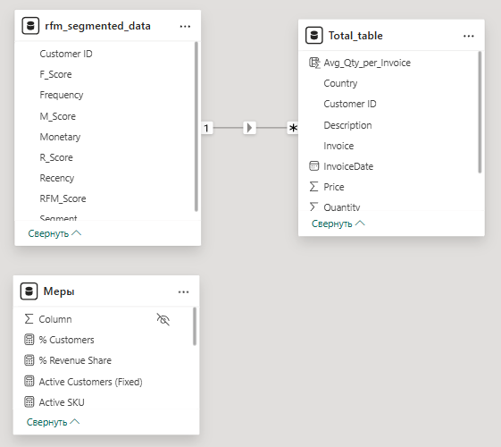
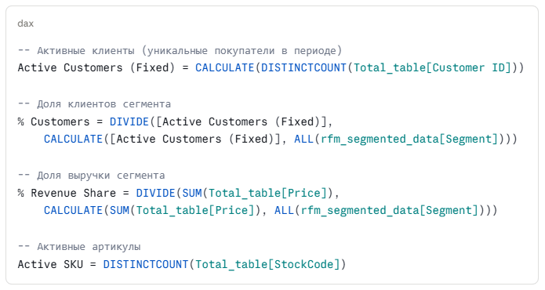
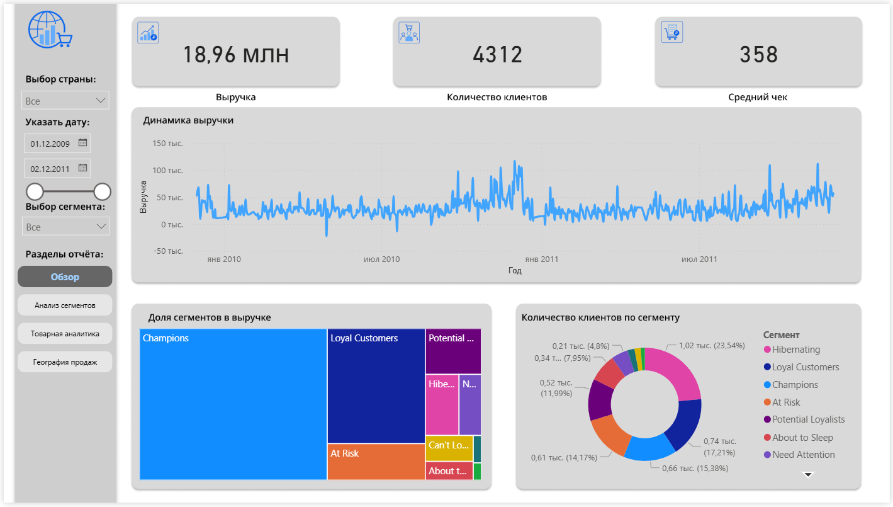
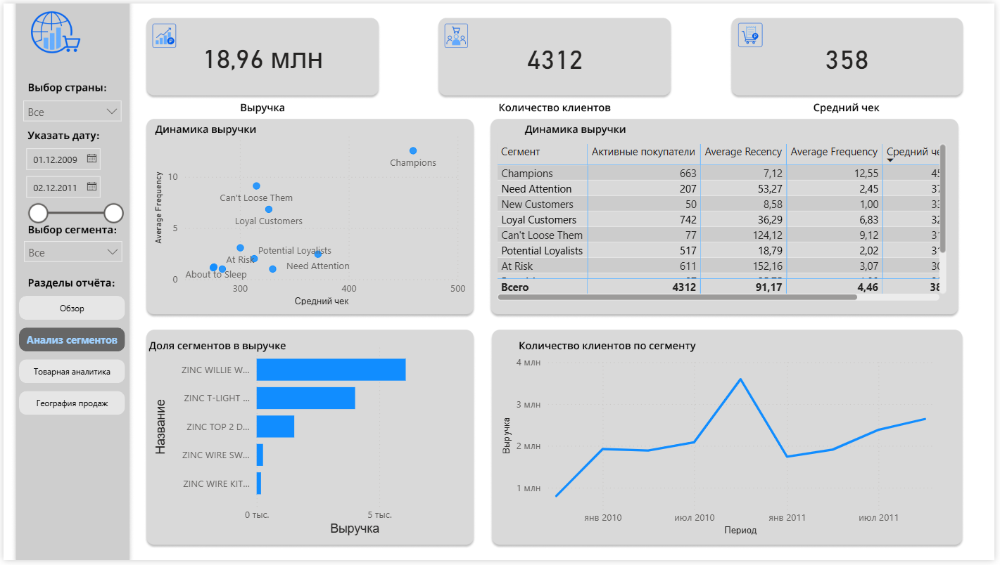
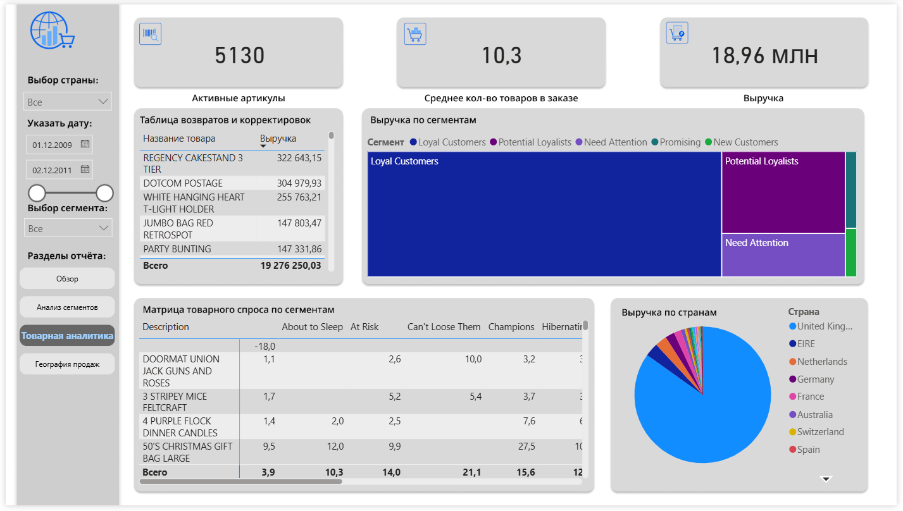
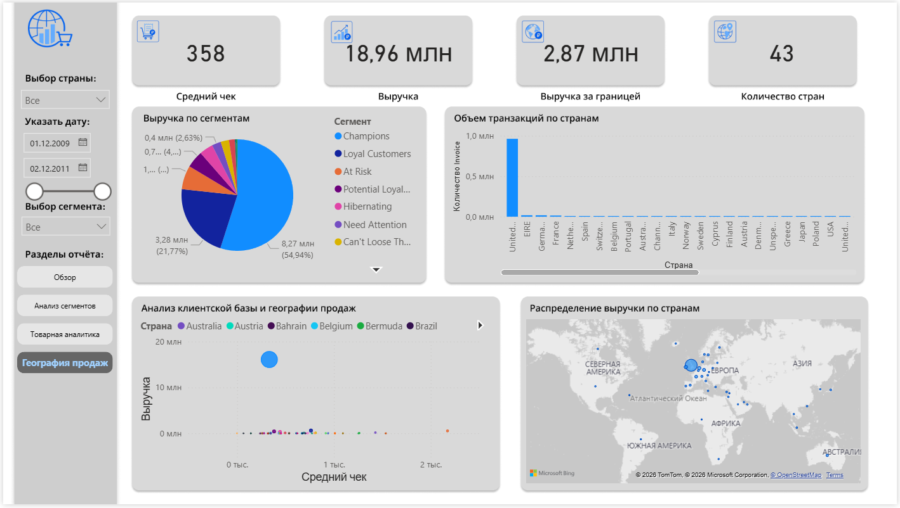
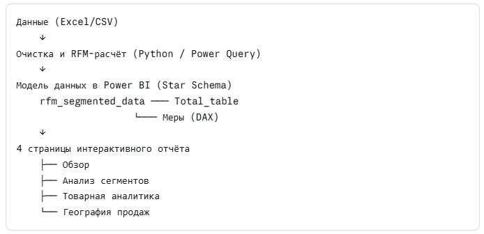

# **RFM-анализ и аналитический дашборд для онлайн-ритейлера**

## **О проекте**

**Индустрия:** Онлайн-ритейл (B2B и B2C)  
**Инструменты:** Power BI Desktop, DAX, Python (подготовка данных), Excel  
**Датасет:** [Online Retail Dataset — Kaggle / UCI ML Repository](https://www.kaggle.com/datasets/lakshmi25npathi/online-retail-dataset)**Период данных:** Декабрь 2009 — Декабрь 2011  
**Размер датасета:** ~1 млн транзакций, 4 312 уникальных клиентов, 43 страны

## **Контекст и постановка задачи**

Датасет представляет собой реальные транзакционные данные британского интернет-магазина, специализирующегося на оптовых продажах подарочных товаров. Основные покупатели — розничные торговцы из Великобритании и других стран.

**Исходные данные содержат:**

- InvoiceNo — номер накладной (префикс «C» = возврат)
- StockCode — артикул товара
- Description — наименование товара
- Quantity — количество единиц
- InvoiceDate — дата и время транзакции
- UnitPrice — цена за единицу (GBP)
- CustomerID — идентификатор клиента
- Country — страна клиента

**Бизнес-задача:** Собственник магазина хочет понять, кто его клиенты, как распределяется выручка между сегментами, какие товары драйвят продажи и как работает международное направление. Финальная цель — интерактивный дашборд для принятия маркетинговых и операционных решений.

## **Подготовка данных и модель**

### **Очистка и трансформация**

Перед построением отчёта данные были очищены и подготовлены:

- Удалены строки без CustomerID (~25% от общего объёма)
- Отфильтрованы возвраты (инвойсы с префиксом «C») и аномальные значения цен (≤ 0)
- Рассчитана выручка по каждой строке: Revenue = Quantity × UnitPrice
- Добавлена таблица с RFM-скорами для каждого клиента

### **Модель данных в Power BI**

Модель состоит из трёх объектов:

| **Таблица** | **Назначение** |
| --- | --- |
| Total_table | Факт-таблица: все транзакции с полями Invoice, Date, CustomerID, Country, Description, Price, Quantity |
| --- | --- |
| rfm_segmented_data | Справочник клиентов: R/F/M-скоры, итоговый RFM_Score и присвоенный сегмент |
| --- | --- |
| Меры | Изолированная таблица с DAX-мерами |
| --- | --- |

Связь: rfm_segmented_data\[Customer ID\] → Total_table\[Customer ID\] (один ко многим).

### **Ключевые DAX-меры**

## **RFM-сегментация**

RFM (Recency · Frequency · Monetary) — классический метод поведенческой сегментации клиентов. Каждому клиенту присваивается балл от 1 до 5 по трём измерениям:

- Recency — сколько дней назад была последняя покупка (чем меньше — тем лучше)
- Frequency — сколько раз клиент совершал покупки за период
- Monetary — суммарная выручка с клиента

На основе комбинации RFM_Score клиенты делятся на 8 сегментов:

| **Сегмент** | **Характеристика** |
| --- | --- |
| **Champions** | Покупают часто, недавно и на большие суммы |
| --- | --- |
| **Loyal Customers** | Регулярные покупатели с высокой частотой |
| --- | --- |
| **Potential Loyalists** | Недавно пришли, делают повторные покупки |
| --- | --- |
| **New Customers** | Первая покупка совсем недавно |
| --- | --- |
| **Promising** | Недавно пришли, но пока редко |
| --- | --- |
| **Need Attention** | Средние показатели, риск оттока |
| --- | --- |
| **At Risk** | Когда-то покупали часто, но давно не возвращались |
| --- | --- |
| **Hibernating** | Давно неактивны, низкая ценность |
| --- | --- |

## **Результаты анализа**

### **Дашборд 1 — Обзор**

**Ключевые метрики за период:**

- Выручка: 18,96 млн GBP
- Количество клиентов: 4 312
- Средний чек: 358 GBP

Временной ряд выручки отражает волатильность на уровне недели/месяца с заметным пиком в конце 2010 — начале 2011 года и сезонным всплеском в конце 2011 года. Это характерно для подарочной розницы с пиками в Рождество и предновогодний период.

Распределение выручки по сегментам (tree map) показывает явное доминирование Champions — они занимают более половины прямоугольника, что указывает на высокую концентрацию выручки в топ-сегменте. Это типичная картина для B2B-ритейла.

**Распределение клиентов по сегментам (donut chart):**

- Hibernating — 23,54% (наибольшая доля по числу клиентов)
- Loyal Customers — 17,21%
- Champions — 15,38%
- At Risk — 14,17%

Вывод: При том что Champions — только 15% клиентов, они генерируют непропорционально большую долю выручки. Сегмент Hibernating крупный, но требует реактивационных кампаний.

### **Дашборд 2 — Анализ сегментов**

Scatter-plot «Средний чек vs. Средняя частота» позволяет визуально оценить позиционирование каждого сегмента:

- Champions — правый верхний угол: высокий чек (≈500 GBP) и максимальная частота (>10 покупок)
- Can't Loose Them — высокая частота, но умеренный чек
- At Risk — низкая частота, высокий чек (покупали редко, но дорого)
- About to Sleep / Need Attention — низкие показатели по обеим осям

**Таблица RFM-метрик по сегментам:**

| **Сегмент** | **Клиентов** | **Avg Recency (дни)** | **Avg Frequency** | **Средний чек** |
| --- | --- | --- | --- | --- |
| Champions | 663 | 7   | 12,55 | ~450 GBP |
| --- | --- | --- | --- | --- |
| Loyal Customers | 742 | 36  | 6,83 | ~320 GBP |
| --- | --- | --- | --- | --- |
| At Risk | 611 | 152 | 3,07 | ~300 GBP |
| --- | --- | --- | --- | --- |
| Potential Loyalists | 517 | 19  | 2,02 | ~310 GBP |
| --- | --- | --- | --- | --- |
| Need Attention | 207 | 53  | 2,45 | ~370 GBP |
| --- | --- | --- | --- | --- |
| New Customers | 50  | 9   | 1,00 | ~330 GBP |
| --- | --- | --- | --- | --- |
| Can't Loose Them | 77  | 124 | 9,12 | ~310 GBP |
| --- | --- | --- | --- | --- |
| **Всего** | **4 312** | **91** | **4,46** | **~380 GBP** |
| --- | --- | --- | --- | --- |

**Топ-товары (горизонтальная bar chart):**

- ZINC WILLIE W... — лидер по выручке
- ZINC T-LIGHT ... — второе место
- ZINC TOP 2 D... — третье место

Все три топ-позиции из одной продуктовой линейки Zinc — это сигнал для категорийного менеджера.

Динамика выручки по периодам показывает выраженный пик в ноябре 2010 года (~3,5 млн GBP) с последующим спадом и восстановлением.

### **Дашборд 3 — Товарная аналитика**

**Ключевые метрики:**

- Активных артикулов: 5 130
- Среднее кол-во товаров в заказе: 10,3
- Выручка: 18,96 млн GBP

Таблица возвратов и корректировок показывает топ-товары по суммарной выручке (включая возвраты, учитываемые как отрицательная выручка):

| **Товар** | **Выручка** |
| --- | --- |
| REGENCY CAKESTAND 3 TIER | 322 643 GBP |
| --- | --- |
| DOTCOM POSTAGE | 304 980 GBP |
| --- | --- |
| WHITE HANGING HEART T-LIGHT HOLDER | 255 763 GBP |
| --- | --- |
| JUMBO BAG RED RETROSPOT | 147 803 GBP |
| --- | --- |
| PARTY BUNTING | 147 332 GBP |
| --- | --- |

Tree map «Выручка по сегментам» показывает, что Loyal Customers и Potential Loyalists генерируют значительную долю товарной выручки — важный сигнал для формирования ассортиментных предложений под каждый сегмент.

Матрица товарного спроса по сегментам — кросс-таблица, где строки — товары, столбцы — сегменты, значения — среднее количество в заказе. Позволяет выявить товары-«якоря» для каждого сегмента:

- 50'S CHRISTMAS GIFT BAG LARGE — популярен у Champions (27,5 ед./заказ) и Hibernating
- DOORMAT UNION JACK — высокий спрос у Can't Loose Them (10,0 ед.)

Pie chart «Выручка по странам» подтверждает доминирование Великобритании — более 80% выручки.

### **Дашборд 4 — География продаж**

**Ключевые метрики:**

- Количество стран: 43
- Выручка за рубежом: 2,87 млн GBP
- Средний чек: 358 GBP

**Pie chart «Выручка по сегментам»:**

- Champions — 54,94% (8,27 млн GBP)
- Loyal Customers — 21,77% (3,28 млн GBP)
- Остальные сегменты — менее 5% каждый

Гистограмма «Объём транзакций по странам» наглядно демонстрирует, что United Kingdom кратно превосходит все остальные рынки. Первые международные рынки по количеству транзакций: EIRE (Ирландия), Германия, Франция, Нидерланды, Испания.

Scatter-plot «Анализ клиентской базы и географии продаж» — пузырьковая диаграмма, где каждый пузырь — страна, ось X — средний чек, ось Y — выручка, размер — количество клиентов. Один явный выброс (UK) с выручкой ~20 млн и средним чеком ~1000 GBP. Все остальные рынки сконцентрированы в нижнем левом кластере.

Карта «Распределение выручки по странам» визуализирует географическое покрытие: основная концентрация в Западной Европе, отдельные точки в Австралии, США, на Ближнем Востоке.

Вывод: Бизнес глубоко сконцентрирован на UK-рынке. Международное направление имеет потенциал роста — особенно EIRE, Германия и Франция показывают стабильный спрос.

## **Ключевые инсайты и рекомендации**

### **1\. Концентрация выручки в топ-сегменте требует внимания**

Champions (≈15% клиентов) генерируют более 55% выручки. Это создаёт риск: уход даже небольшой части этих клиентов критически скажется на показателях. Рекомендация: Разработать программу удержания Champions (VIP-статус, персональные условия, early access).

### **2\. Сегмент At Risk — главный приоритет реактивации**

611 клиентов (14% базы) не делали покупки в среднем 152 дня. При этом их средний чек (~300 GBP) говорит о реальной ценности. Рекомендация: Автоматическая win-back кампания через 90 дней после последней покупки.

### **3\. Hibernating — большой, но недооценённый пул**

23,5% клиентской базы находятся в «спячке». Даже конвертация 10% из них в активных покупателей даст ощутимый прирост. Рекомендация: Сегментированная email-кампания с персональным предложением, основанным на истории покупок.

### **4\. Товарная концентрация: риск и возможность**

Топ-5 товаров генерируют непропорционально большую долю выручки. Линейка ZINC доминирует. Рекомендация: Провести ABC-анализ по маржинальности, не только по выручке.

### **5\. Международный рынок недоразвит**

2,87 млн GBP (≈15%) из 43 стран — низкий показатель для компании с таким ассортиментом. EIRE, Германия и Нидерланды уже демонстрируют устойчивый спрос. Рекомендация: Выделить международных клиентов в отдельный RFM-сегмент и разработать локализованные предложения.

## **Техническая реализация**

### **Стек и архитектура решения**

### **Фильтры и интерактивность**

Отчёт поддерживает сквозную фильтрацию по:

- Стране — выпадающий список
- Периоду — date picker + range slider
- Сегменту — выпадающий список

Все визуализации на каждой странице связаны между собой и реагируют на фильтры синхронно.

## **Чему научил этот проект**

- Практика построения **RFM-сегментации** на реальных транзакционных данных с неравномерным распределением и выбросами
- Проектирование **Star Schema** в Power BI с изолированной таблицей мер
- Написание **DAX-мер** с контекстом фильтрации (ALL, CALCULATE, DIVIDE)
- Построение **аналитического нарратива**: от сырых данных — к конкретным бизнес-рекомендациям
- Работа с **многостраничными дашбордами** с единой системой фильтров

##
