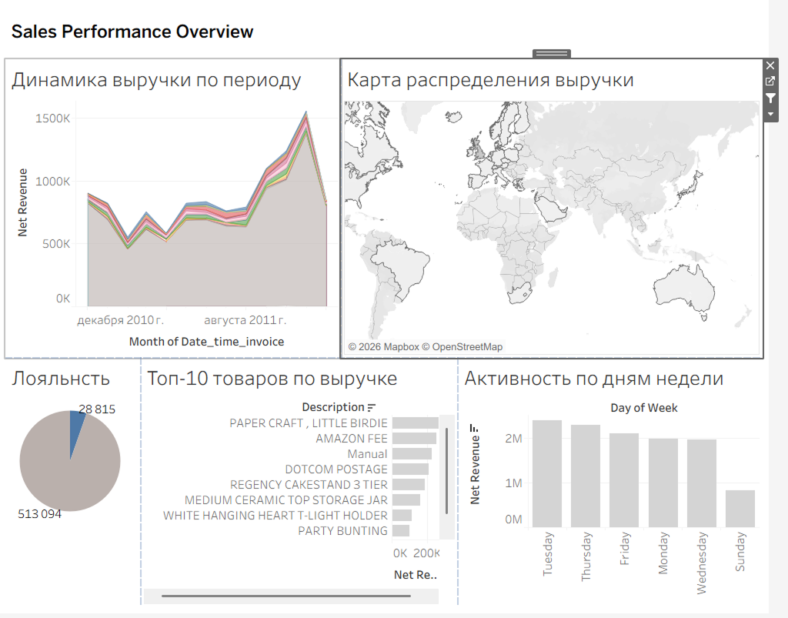
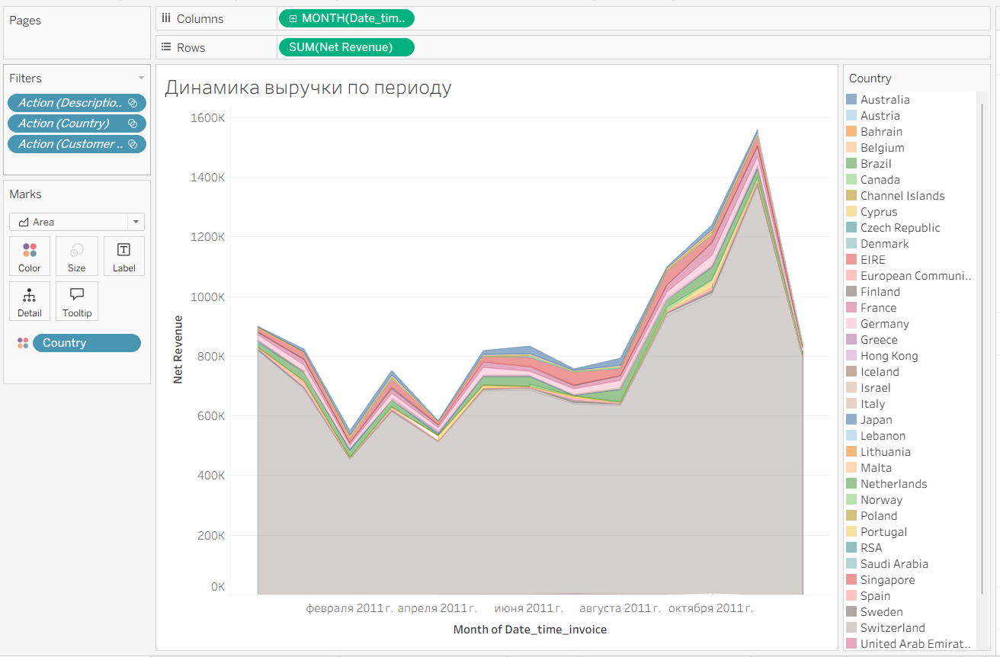
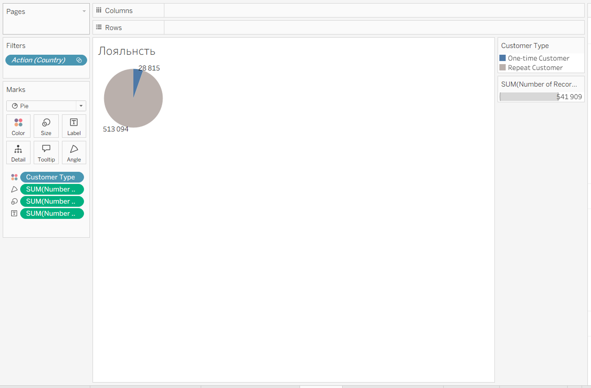
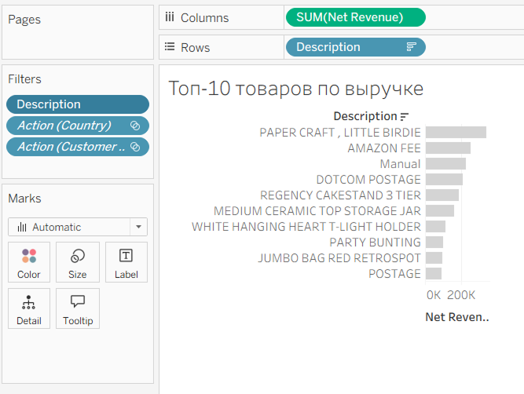

# Аналитика продаж онлайн-ритейлера (Tableau Project)

## Обзор проекта
Данный проект посвящен анализу транзакционных данных онлайн-магазина. Цель — выявить ключевые драйверы выручки, оценить лояльность клиентов и определить сезонность продаж с помощью интерактивного дашборда в Tableau.

## Цели и задачи
* **Цель:** Трансформировать «сырые» данные в понятные бизнес-инсайты.
* **Задачи:**
    1. Провести очистку и предобработку данных (data cleaning).
    2. Создать производные метрики (выручка, активность, типы клиентов).
    3. Разработать интерактивные визуализации для анализа географии, динамики продаж и поведения пользователей.

## Инструменты
* **BI Tool:** Tableau Desktop
* **Методология:** EDA (Exploratory Data Analysis)

---

## Процесс реализации

### 1. Подготовка данных и создание метрик
Для анализа потребовалось расширить исходный набор данных, создав ряд вычисляемых полей (Calculated Fields):
* `Net Revenue` (Выручка) = `Quantity` * `UnitPrice`.
* `Customer Type` (Сегментация) — классификация клиентов на "One-time" и "Repeat" на основе количества транзакций.
* `Day of Week` — для выявления пиковых дней активности.

### 2. Визуализация и Дашборд
Был создан комплексный дашборд, объединяющий 5 ключевых графиков с перекрестной фильтрацией.

*Рисунок 1: Итоговый интерактивный дашборд*

---

## Основные результаты (Insights)

### Анализ динамики и сезонности
На графике прослеживается выраженная сезонность. Пики продаж приходятся на конец года, что позволяет бизнесу планировать маркетинговые активности и логистику заранее.

*Рисунок 2: Тренд выручки по месяцам*

### Лояльность клиентов
Сегментация показала долю постоянных покупателей. Это критический инсайт: мы видим, какая часть базы требует мероприятий по удержанию (Retention).

*Рисунок 3: Сегментация клиентов по типу (постоянные vs одноразовые)*

### География и товарная аналитика
Использование интерактивной карты позволило выявить ключевые регионы присутствия, а столбчатая диаграмма — определить товары-бестселлеры, формирующие основную часть выручки.

*Рисунок 4: Топ-10 товаров по объему выручки*

---

## Выводы
Проект продемонстрировал, что основной объем выручки генерируется узким сегментом товаров и определенной географией. Интерактивные фильтры на дашборде позволяют менеджменту «проваливаться» в данные (drill-down), анализируя поведение клиентов в разрезе дней недели и типов лояльности.
